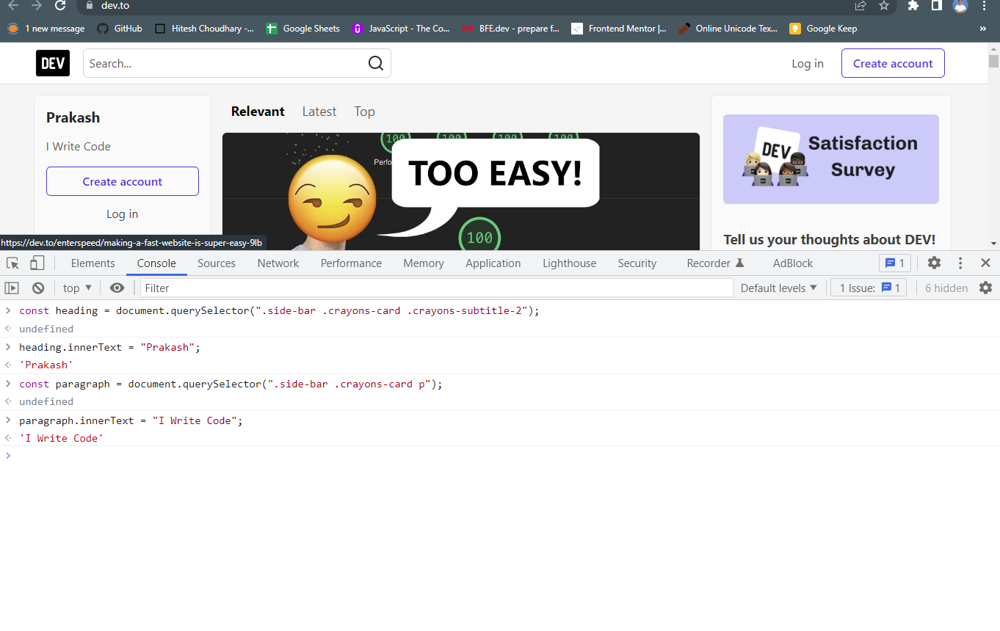

## ⭐ DOM Manipulation Assignments ⭐

> These 20 DOM manipulation assignments were given us in **"JavaScript Full Stack Web Developer Bootcamp"** by **iNeuron** which test our DOM manipulation skills. We tried to manipulate DOM elements of different websites.

  

## 🔥 Task 01

#### 📌 Webiste Name: [Dev To](https://dev.to/)

#### Sample Image

#### Tasks

> Target the Top description div and change the DEV Community to <Your_Name> and description to your passion

#### Expected Output

#### Code

#### My Output

